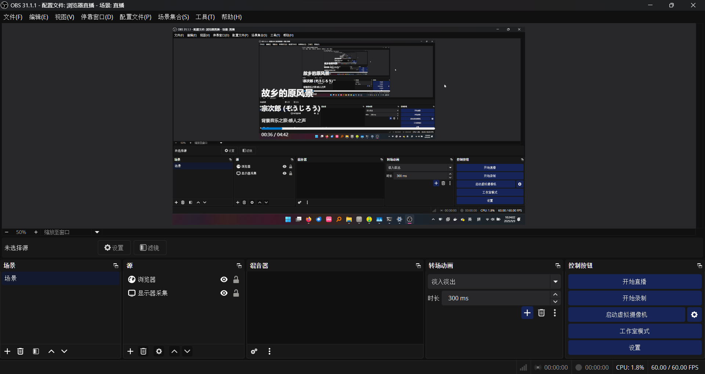

# smtc2web

 A base of Rust's smtc2web achieve, Using in Live Stream Software show Playing Music.

**LinuxDO Reference Post:** https://linux.do/t/topic/937994

**[Join Translate](https://crowdin.com/project/smtc2web)** **[中文](./README.md)**

> The new icon combines Bootstrap's headphone image with Rust's Ferris character to create an icon of listening to music with headphones.

## Recommand IDE Setup 

- [VS Code](https://code.visualstudio.com/) + [Tauri](https://marketplace.visualstudio.com/items?itemName=tauri-apps.tauri-vscode) + [rust-analyzer](https://marketplace.visualstudio.com/items?itemName=rust-lang.rust-analyzer)
- [TRAE](https://trae.com.cn/) + [Tauri](https://marketplace.visualstudio.com/items?itemName=tauri-apps.tauri-vscode) + [rust-analyzer](https://marketplace.visualstudio.com/items?itemName=rust-lang.rust-analyzer)
- [Zed](https://zed.dev/)

## Build

- [Windows](https://smtc2web.org/wiki/compile/windows)
