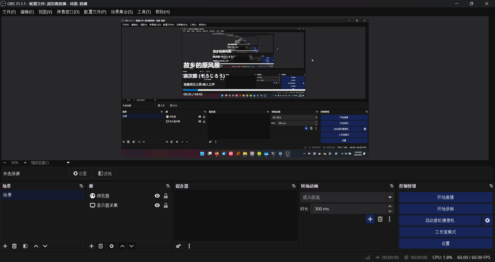

# smtc2web

 一个基于 Rust 的 smtc2web 实现，用于在直播软件实时显示正在播放的歌曲。

> 注意：新增的图标为 Qwen3-Max-Preview 生成。

## 推荐 IDE 配置

- [VS Code](https://code.visualstudio.com/) + [Tauri](https://marketplace.visualstudio.com/items?itemName=tauri-apps.tauri-vscode) + [rust-analyzer](https://marketplace.visualstudio.com/items?itemName=rust-lang.rust-analyzer)
- [TRAE](https://trae.com.cn/) + [Tauri](https://marketplace.visualstudio.com/items?itemName=tauri-apps.tauri-vscode) + [rust-analyzer](https://marketplace.visualstudio.com/items?itemName=rust-lang.rust-analyzer)

## 构建

- [Windows](https://github.com/AkarinLiu/smtc2web/wiki/%E5%9C%A8-Windows-%E7%8E%AF%E5%A2%83%E4%B8%8B%E7%BC%96%E8%AF%91)